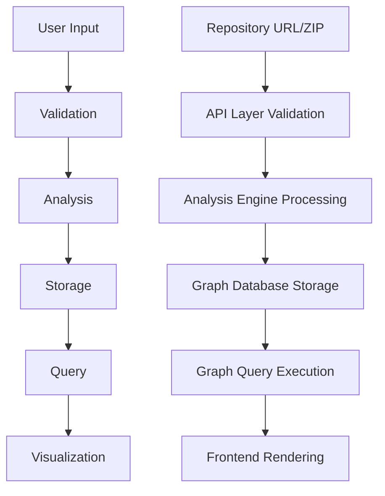

# CodeMap: Architecture Design

**TL;DR:** Four-layer architecture with graph-centric data model. Analysis engine separated from visualization. Built for scalability, accuracy, and extensibility.

## 1. Architecture Intent & Design Principles

**Why This Architecture Exists:** CodeMap solves architectural opacity—our own architecture must exemplify clarity and intentional design.

**Planning Foundation:** Designed using **Kiro's structured approach** before implementation. Every component addresses core problems: cognitive overload, hidden dependencies, knowledge transfer barriers.

### Core Design Principles

| **Principle** | **Implementation** | **Benefit** |
|---------------|-------------------|-------------|
| **Accuracy from Source** | Parse actual code, not documentation | Truth reflects reality |
| **Separation of Concerns** | Analysis ↔ Storage ↔ API ↔ Visualization | Clean interfaces, independent scaling |
| **Language Extensibility** | Pluggable parsers, consistent graph model | Add languages without core changes |
| **Visualization-First** | Data structures optimized for visual queries | Real-time graph navigation |

## 2. High-Level Logical Architecture

**TL;DR:** Four-layer separation with clear data flow and responsibilities.

### System Architecture Diagram

```
┌─────────────────────────────────────────────────────────┐
│           Frontend Visualization Layer                  │
│              (Next.js / React)                          │
│  • Interactive graphs  • User interface  • Navigation  │
├─────────────────────────────────────────────────────────┤
│              API & Orchestration Layer                  │
│                    (Go)                                 │
│  • Request routing  • Query execution  • Data format   │
├─────────────────────────────────────────────────────────┤
│            Static Code Analysis Engine                  │
│               (Language Parsers)                        │
│  • Code parsing  • Relationship extraction  • Metadata │
├─────────────────────────────────────────────────────────┤
│               Graph Data Layer                          │
│                 (Neo4j Graph)                           │
│  • Node storage  • Edge relationships  • Query engine  │
└─────────────────────────────────────────────────────────┘
```

### Component Responsibilities

| **Layer** | **Consumes** | **Produces** | **Does NOT Do** |
|-----------|--------------|--------------|-----------------|
| **Frontend** | Graph query results, project metadata | Interactive visualizations, UI state | Store analysis data, parse code |
| **API** | Repository URLs, graph queries | RESTful responses, orchestration | Parse source code, store graph data |
| **Analysis** | Source code files, parsing configs | Code entities, relationships, metadata | Store results, handle UI, provide queries |
| **Graph** | Entities/relationships, queries | Query results, graph statistics | Parse code, handle HTTP, generate UI |

⚡ **Scalability:** Each layer scales independently
🧩 **Modularity:** Clear interfaces enable component replacement  
🔁 **Extensibility:** Add features without architectural changes

## 3. End-to-End System Flow (Data Flow Diagram)

**TL;DR:** Seven-step flow from user input to interactive visualization. Each step has clear inputs, processing, and outputs.

### Why Data Flow Diagram?
CodeMap's philosophy: make complex systems visually understandable. Our system design exemplifies this principle.

### Complete System Flow



### Detailed Flow Steps

| **Step** | **Component** | **Input** | **Processing** | **Output** |
|----------|---------------|-----------|----------------|------------|
| **1. User Access** | Frontend | User interaction | Repository URL/ZIP validation | Validated input |
| **2. Request Validation** | API Layer | Repository info | Accessibility check, job creation | Analysis job |
| **3. Source Analysis** | Analysis Engine | Source code | Language detection, parsing | Entities/relationships |
| **4. Entity Extraction** | Analysis Engine | Parsed code | Function/class/dependency mapping | Structured data |
| **5. Graph Storage** | Graph Database | Entities/relationships | Node/edge creation with properties | Stored graph |
| **6. Query Execution** | API Layer | Graph queries | Dependency traversal, impact analysis | Query results |
| **7. Visualization** | Frontend | Query results | Interactive graph rendering | User interface |

## 4. Why Graph-Centric Architecture Is Essential

**TL;DR:** Code is naturally graph-structured. Graph architecture enables the queries developers actually need.

### Natural Code-to-Graph Mapping

| **Code Element** | **Graph Representation** | **Properties** |
|------------------|--------------------------|----------------|
| **Files** | Nodes | Size, complexity, language |
| **Functions** | Nodes | Parameters, return types, visibility |
| **Classes** | Nodes | Inheritance, composition relationships |
| **Variables** | Nodes | Scope, usage patterns |
| **Function Calls** | Directed Edges | Call frequency, coupling strength |
| **Imports** | Dependency Edges | Coupling strength, type info |
| **Data Flow** | Edges | Data types, transformation paths |
| **Inheritance** | Hierarchical Edges | Override patterns, polymorphism |

### Core Problem Solutions

**🔍 Hidden Dependencies → Visible Relationships**
- Query: "What depends on this function?" = Graph traversal
- Impact analysis follows edges to affected components
- No more surprise breakages from unknown connections

**🛡️ Safer Refactoring → Impact Analysis**
- Query all dependent nodes before changes
- Visualize complete impact scope
- Identify breaking changes through relationship analysis

**⚡ Faster Onboarding → Architectural Overview**
- System structure visible immediately
- Most connected components = most important
- Navigation follows natural code relationships

## 5. Key Architectural Decisions

**TL;DR:** Four critical decisions that enable scalability, maintainability, and performance.

### Decision Matrix

| **Decision** | **Alternative Considered** | **Why Chosen** | **Benefit** |
|--------------|---------------------------|----------------|-------------|
| **Separated Analysis Engine** | Monolithic service | Independent scaling, language updates without API changes | 🧩 Modularity |
| **Language-Agnostic Design** | Language-specific services | Consistent graph schema, cross-language dependencies | 🔁 Extensibility |
| **Read-Heavy Graph Model** | Write-optimized relational | Fast dependency queries, real-time exploration | ⚡ Performance |
| **Stateless Frontend** | Rich client with caching | Simple deployment, multiple frontend support | 🚀 Scalability |

### Engineering Judgment Rationale

**1. Analysis Engine Separation**
- **Problem:** Code analysis is computationally intensive and language-specific
- **Solution:** Independent service with pluggable parsers
- **Result:** Scale analysis independently, update parsers without API downtime

**2. Language-Agnostic Core**
- **Problem:** CodeMap must work across diverse technology stacks
- **Solution:** Consistent graph schema with pluggable language parsers
- **Result:** Add new languages without core system changes

**3. Read-Optimized Graph Queries**
- **Problem:** Analysis happens once, queries happen continuously
- **Solution:** Graph database optimized for traversal operations
- **Result:** Real-time impact analysis and interactive exploration

**4. Stateless Visualization Layer**
- **Problem:** Visualization complexity sufficient without state management
- **Solution:** Frontend focused purely on rendering and interaction
- **Result:** Simple deployment, clear separation of concerns

## 6. Scope Boundaries (Intentional Non-Goals)

**TL;DR:** Disciplined focus on core value proposition. Clear boundaries enable deep execution.

### Excluded by Design

| **Feature** | **Why Excluded** | **Focus Benefit** |
|-------------|------------------|-------------------|
| **Runtime Execution Tracing** | Static analysis provides architectural understanding without execution complexity | Analyze any codebase regardless of runtime environment |
| **Real-Time Collaboration** | Individual understanding must be solved before team features | Perfect core visualization without distributed system complexity |
| **AI Code Suggestions** | CodeMap solves understanding, not generation | Clear value proposition around architectural visibility |

### Strategic Framing

**Not Limitations → Disciplined Focus**
- Solve core problem completely vs. multiple problems partially
- Enable deep execution on architectural comprehension
- Maintain clear value proposition without feature creep

## 7. Architectural Extensibility

**TL;DR:** Foundation enables future capabilities without architectural redesign.

### Extension Pathways

| **Capability** | **Current Foundation** | **Extension Method** | **Benefit** |
|----------------|------------------------|---------------------|-------------|
| **New Language Parsers** | Pluggable parser interface | Implement standard extraction interface | Language support grows without core changes |
| **Advanced Graph Queries** | Graph database with traversal optimization | Add query patterns (hotspots, cycles, dead code) | Enhanced analysis capabilities |
| **Team-Level Features** | Project-based analysis with unique IDs | Multi-project graphs, team dashboards | Individual understanding scales to team coordination |

### Future Capabilities Enabled

**Language Expansion**
- Current: Consistent graph schema across languages
- Future: New parsers plug in without system changes
- Benefit: Rapid language support expansion

**Advanced Analytics**
- Current: Graph optimized for relationship traversal
- Future: Hotspot analysis, circular dependencies, dead code detection
- Benefit: Deeper architectural insights

**Team Coordination**
- Current: Individual project analysis
- Future: Multi-project views, change impact notifications
- Benefit: Team-scale architectural understanding

🔁 **Extensibility Principle:** Clear layer interfaces enable enhancement without redesign.

---

## Architecture Summary

**Validation:** This architecture transforms abstract code comprehension problems into concrete visual exploration systems.

### Key Architectural Strengths

⚡ **Scalability:** Each layer scales independently, graph database handles millions of relationships
🧩 **Modularity:** Clean separation enables component replacement and independent development  
🔁 **Extensibility:** Pluggable parsers and clear interfaces support future capabilities
🎯 **Purpose-Built:** Every component serves the goal of making hidden dependencies visible

### Implementation Readiness

**Clear Boundaries:** Defined component responsibilities and interfaces
**Proven Technologies:** Built on established patterns (graph databases, static analysis, visualization)
**Extensible Patterns:** Architecture supports growth without redesign

**Ready for Implementation:** Clear component boundaries, defined interfaces, and extensible patterns enable immediate development start.