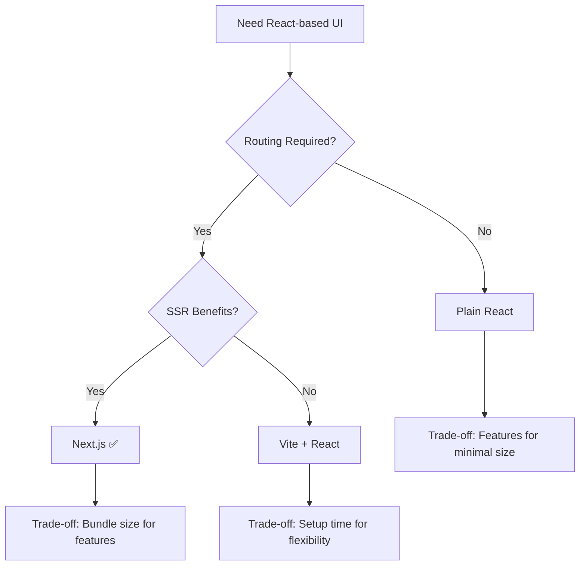

# CodeMap: Engineering Decisions & Trade-offs

**TL;DR:** Key technology and design decisions with honest trade-off assessment. Visual decision matrix shows alternatives considered and compromises accepted.

## Intent of This Document

This document captures engineering decisions made during CodeMap development. Each decision shows alternatives considered, rationale, and accepted trade-offs through visual comparison matrices and decision trees.

## Decision Overview Matrix

| **Decision Area** | **Chosen Technology** | **Key Alternative** | **Primary Trade-off** |
|-------------------|----------------------|---------------------|------------------------|
| **Backend Language** | Go | Node.js | Slower iteration ↔ Better performance |
| **Frontend Framework** | Next.js | Vite + React | Heavier footprint ↔ Built-in features |
| **Graph Database** | Neo4j | PostgreSQL | Operational complexity ↔ Natural relationships |
| **Relational Database** | PostgreSQL | MongoDB | Schema rigidity ↔ Data consistency |
| **Authentication** | JWT | Session-based | Token complexity ↔ Stateless scaling |
| **Source Ingestion** | GitHub + ZIP | Raw folder upload | Dual complexity ↔ Better user experience |
| **Graph Visualization** | Cytoscape.js | react-force-graph-2d | Learning curve ↔ Reliability |
| **Data Model** | Neo4j Browser format | Custom format | Refactoring effort ↔ Industry compatibility |
| **Large Codebases** | Limited initial size | Full optimization | MVP focus ↔ Future scalability |
| **Package Manager** | Yarn | npm | Learning curve ↔ Dependency resolution |

## 1. Backend Language – Go

### Decision Comparison

| **Criteria** | **Go** | **Node.js** | **Python** |
|--------------|--------|-------------|------------|
| **Concurrency** | ✅ Excellent (goroutines) | ⚠️ Good (event loop) | ❌ Limited (GIL) |
| **Performance** | ✅ Predictable, fast | ⚠️ Variable | ❌ Slower |
| **Type Safety** | ✅ Static typing | ❌ Dynamic | ❌ Dynamic |
| **Development Speed** | ❌ Slower iteration | ✅ Rapid prototyping | ✅ Quick scripting |
| **Library Ecosystem** | ⚠️ Growing | ✅ Massive | ✅ Extensive |

### Why Go Won

```
Analysis Workload Requirements:
├── Heavy file parsing operations
├── Concurrent processing needs
├── Predictable performance critical
└── Type safety for complex logic

Go Strengths Match:
├── ✅ Goroutines handle concurrency naturally
├── ✅ Static typing catches dependency bugs
├── ✅ Consistent performance characteristics
└── ✅ Excellent API development tooling
```

### Trade-offs Accepted

| **What We Gained** | **What We Lost** |
|-------------------|------------------|
| Predictable performance | Rapid prototyping speed |
| Strong concurrency | Large library ecosystem |
| Type safety | Dynamic flexibility |
| Robust error handling | Quick iteration cycles |

## 2. Frontend Framework – Next.js (React)

### Framework Comparison Matrix

| **Feature** | **Next.js** | **Vite + React** | **Plain React** |
|-------------|-------------|------------------|-----------------|
| **Setup Time** | ⚡ Instant | ⚠️ Configuration needed | ❌ Manual setup |
| **Routing** | ✅ Built-in | ❌ Add React Router | ❌ Manual implementation |
| **Performance** | ✅ SSR + optimization | ✅ Fast dev server | ⚠️ Client-side only |
| **Bundle Size** | ❌ Heavier | ✅ Minimal | ✅ Lightest |
| **Flexibility** | ⚠️ Opinionated | ✅ Configurable | ✅ Complete control |

### Decision Flow



### Why Next.js

> **Core Need:** Fast development with built-in routing for complex graph visualization UI

**Winning Factors:**
- 🚀 Zero-config routing eliminates setup overhead
- 📈 Built-in performance optimizations
- 🔧 Excellent developer experience with hot reloading
- 📚 Strong ecosystem for visualization libraries

**Accepted Compromises:**
- 📦 Larger bundle size vs. minimal React setups
- 🏗️ Framework opinions vs. complete flexibility

## 3. Graph Database – Neo4j

### Database Architecture Decision

```
Code Relationship Reality:
┌─────────────┐    calls    ┌─────────────┐
│  Function A │ ──────────> │  Function B │
└─────────────┘             └─────────────┘
       │                           │
       │ imports                   │ uses
       ▼                           ▼
┌─────────────┐             ┌─────────────┐
│   Module X  │             │ Variable Y  │
└─────────────┘             └─────────────┘

Graph DB = Natural fit for this structure
```

### Technology Comparison

| **Approach** | **Query Complexity** | **Performance** | **Operational Overhead** | **Learning Curve** |
|--------------|---------------------|-----------------|--------------------------|-------------------|
| **Neo4j** | ✅ Simple Cypher | ✅ Fast traversals | ❌ High | ❌ Steep |
| **PostgreSQL + Joins** | ❌ Complex SQL | ⚠️ Slower for graphs | ✅ Low | ✅ Familiar |
| **In-Memory Graphs** | ✅ Direct access | ✅ Fastest | ✅ Minimal | ⚠️ Custom logic |

### Decision Rationale

**The Graph Advantage:**
```sql
-- Neo4j Cypher (Simple)
MATCH (f:Function)-[:CALLS*1..3]->(deps)
WHERE f.name = "authenticate"
RETURN deps

-- PostgreSQL Equivalent (Complex)
WITH RECURSIVE deps AS (
  SELECT target_id, 1 as depth FROM calls WHERE source_id = ?
  UNION ALL
  SELECT c.target_id, d.depth + 1 
  FROM calls c JOIN deps d ON c.source_id = d.target_id
  WHERE d.depth < 3
) SELECT * FROM deps;
```

### Trade-off Analysis

| **✅ What We Gained** | **❌ What We Accepted** |
|----------------------|------------------------|
| Natural relationship queries | Additional database to manage |
| Fast dependency traversals | Team learning curve |
| Built-in graph algorithms | Higher memory usage |
| Intuitive data model | Limited hosting options |

## 4. Relational Database – PostgreSQL

### Structured Data Requirements

```
Application Data Structure:
├── User accounts & authentication
├── Project metadata & settings  
├── Analysis job status & history
└── System configuration & logs

Requirement: ACID compliance + structured queries
```

### Database Comparison

| **Database** | **ACID Compliance** | **Schema Flexibility** | **Ecosystem** | **Operational Complexity** |
|--------------|-------------------|----------------------|---------------|---------------------------|
| **PostgreSQL** | ✅ Full ACID | ❌ Rigid schema | ✅ Mature | ⚠️ Moderate |
| **MongoDB** | ⚠️ Eventually consistent | ✅ Flexible documents | ✅ Good | ✅ Simple |
| **SQLite** | ✅ Full ACID | ❌ Rigid schema | ⚠️ Limited | ✅ Minimal |

### Why PostgreSQL

**Decision Drivers:**
- 🔒 **Data Integrity:** User data and project metadata need consistency
- 📊 **Complex Queries:** Analytics and reporting require SQL capabilities  
- 🛠️ **Tooling:** Mature ecosystem for monitoring and management
- 🔄 **Reliability:** Battle-tested in production environments

**Trade-off Visualization:**
```
Flexibility ←→ Consistency
    │              │
MongoDB        PostgreSQL ✅
    │              │
Simple ops ←→ Rich features
```

## 5. Authentication – JWT

### Authentication Architecture Decision

```
Session-based:
Client ←→ Server (stores session)
  │         │
  └─ Cookie ─┘
  
JWT-based:
Client ←→ Server (stateless)
  │         │
  └─ Token ──┘ (self-contained)
```

### Comparison Matrix

| **Aspect** | **JWT** | **Session-based** |
|------------|---------|-------------------|
| **Server State** | ✅ Stateless | ❌ Session storage required |
| **Scalability** | ✅ Easy horizontal scaling | ⚠️ Shared session store needed |
| **Security** | ⚠️ Token revocation complex | ✅ Immediate revocation |
| **Network Overhead** | ❌ Larger requests | ✅ Small cookies |
| **Implementation** | ✅ Standard libraries | ⚠️ Custom session management |

### Decision Flow

```
API Design Goal: Stateless scaling
         │
         ▼
    Need authentication
         │
    ┌────┴────┐
    │         │
Sessions    JWT ✅
    │         │
Shared      Stateless
storage     scaling
required    enabled
```

### Trade-off Summary

| **JWT Benefits** | **JWT Costs** |
|------------------|---------------|
| 🚀 Stateless API design | 🔄 Complex token revocation |
| 📈 Easy scaling | 📦 Larger request payloads |
| 🔧 Standard implementation | 🧠 Frontend token management |
| 🌐 Cross-service compatibility | 🔒 Token storage security |


## 6. Source Ingestion – GitHub Repository + ZIP Upload

### User Input Challenge

**The Question:** How should developers share their code with CodeMap for analysis?

```
👩‍💻 USER SCENARIOS & NEEDS
┌─────────────────────────────────────────────────────────────────┐
│  Developer Types & Their Preferences:                          │
│  ┌─────────────────────────────────────────────────────────┐   │
│  │ 🌐 Open Source Dev    → GitHub integration preferred    │   │
│  │ 🏢 Enterprise Dev     → Private code via ZIP needed     │   │
│  │ 💼 Freelancer         → Quick local analysis wanted     │   │
│  │ 🔒 Security-Conscious → Full upload control required    │   │
│  └─────────────────────────────────────────────────────────┘   │
└─────────────────────────────────────────────────────────────────┘
```

### Solution Approach Comparison

| **Method** | **Accessibility** | **Speed** | **Context** | **User Control** | **Verdict** |
|------------|------------------|-----------|-------------|------------------|-------------|
| **GitHub + ZIP** ✅ | ✅ Universal | ✅ Optimized | ⚠️ Varies | ✅ High | **Chosen** |
| **GitHub Only** | ❌ Public only | ⚠️ Network dependent | ✅ Full | ⚠️ Limited | Rejected |
| **Raw Folder Upload** | ✅ Universal | ✅ Fast | ❌ None | ✅ Complete | Rejected |

### Why Raw Folder Upload Didn't Work

```
❌ FOLDER UPLOAD REALITY CHECK
┌─────────────────────────────────────────────────────────────────┐
│  Browser Limitations:                                          │
│  ├── 🚫 Security restrictions on folder access                 │
│  ├── 🚫 Inconsistent cross-browser support                     │
│  ├── 🚫 Performance issues with large folders                  │
│  └── 🚫 Complex file filtering requirements                    │
│                                                                 │
│  User Experience Problems:                                      │
│  ├── 😕 Confusing: "Which files should I include?"            │
│  ├── 😰 Risky: Accidental sensitive file uploads              │
│  ├── 🤔 Unclear: No standard project expectations             │
│  └── 😤 Frustrating: Slow uploads for large projects          │
└─────────────────────────────────────────────────────────────────┘
```

### Our Dual Strategy Benefits

```
✅ GITHUB INTEGRATION
┌─────────────────────────────────────────────────────────────────┐
│  What Users Get:                                               │
│  ├── 🔗 Just paste repository URL                              │
│  ├── 📚 Full project context preserved                         │
│  ├── 🎯 Automatic file filtering (.gitignore respected)        │
│  ├── 📈 Commit history and metadata included                   │
│  └── 🔄 Reproducible analysis with permanent links             │
└─────────────────────────────────────────────────────────────────┘

✅ ZIP UPLOAD
┌─────────────────────────────────────────────────────────────────┐
│  What Users Get:                                               │
│  ├── 📁 Simple drag-and-drop experience                        │
│  ├── 🔒 Complete privacy for sensitive code                    │
│  ├── ⚡ Instant analysis start (no download wait)              │
│  ├── 🎛️ Full control over included content                     │
│  └── 🌍 Works with any project structure                       │
└─────────────────────────────────────────────────────────────────┘
```

### User Flow Comparison

```
GITHUB WORKFLOW:
User → Paste URL → Auto-download → Analysis → Results
       ↓
   ✅ Familiar & Fast

ZIP WORKFLOW:  
User → Drag ZIP → Extract → Analysis → Results
       ↓
   ✅ Private & Controlled

FOLDER WORKFLOW (Rejected):
User → Select Folder → Filter Files → Upload → Analysis → Results
       ↓
   ❌ Complex & Error-prone
```

### Trade-off Summary

| **✅ What We Gained** | **❌ What We Accepted** |
|----------------------|------------------------|
| 🌍 Universal accessibility | 🔧 Dual implementation paths |
| ⚡ Optimal speed per use case | 🧪 More testing scenarios |
| 🎯 Professional workflow fit | 📝 Two sets of documentation |
| 🔒 Security through user choice | 🛠️ Additional error handling |


## 7. Graph Visualization Library – Cytoscape.js

### The Visualization Challenge

**The Problem:** Our initial choice (react-force-graph-2d) caused blank screens and data mapping headaches during development.

```
😤 REACT-FORCE-GRAPH-2D STRUGGLES
┌─────────────────────────────────────────────────────────────────┐
│  Development Issues We Faced:                                   │
│  ├── 🖥️ Blank screens with no clear error messages             │
│  ├── 🔄 Complex data transformation requirements                │
│  ├── 🐛 Difficult debugging and troubleshooting                │
│  └── ⏰ Time pressure mounting during hackathon                 │
└─────────────────────────────────────────────────────────────────┘
```

### Library Comparison

| **Criteria** | **Cytoscape.js** ✅ | **react-force-graph-2d** | **D3.js** |
|--------------|-------------------|---------------------------|-----------|
| **Reliability** | ✅ Industry-proven | ❌ Caused blank screens | ✅ Stable but complex |
| **Data Compatibility** | ✅ Matches Neo4j format | ❌ Required transformation | ⚠️ Custom implementation |
| **Learning Curve** | ⚠️ Moderate setup | ✅ Simple initially | ❌ Very steep |
| **Professional Quality** | ✅ Production-ready | ⚠️ Basic styling | ✅ Maximum control |
| **Large Graph Handling** | ✅ Optimized | ⚠️ Performance issues | ✅ With custom work |

### Why Cytoscape.js Won

```
✅ CYTOSCAPE.JS ADVANTAGES
┌─────────────────────────────────────────────────────────────────┐
│  Immediate Benefits:                                            │
│  ├── 🛡️ Robust: No more blank screen mysteries                 │
│  ├── 🔗 Compatible: Direct Neo4j data format support           │
│  ├── 🏭 Professional: Industry-standard graph visualization    │
│  ├── 📈 Scalable: Handles large graphs efficiently             │
│  └── 🎨 Flexible: Rich styling and layout options              │
└─────────────────────────────────────────────────────────────────┘
```

### The Switch Decision

```
DECISION MOMENT:
Hackathon Day 2 → Blank screens → Panic → Research → Switch to Cytoscape.js
                                    ↓
                            ✅ Graphs working in 2 hours
```

### Trade-off Summary

| **✅ What We Gained** | **❌ What We Accepted** |
|----------------------|------------------------|
| 🛡️ Reliable graph rendering | 📚 Steeper learning curve |
| 🔗 Neo4j data compatibility | ⚙️ More configuration needed |
| 🏭 Professional-quality visuals | ⏰ Time spent switching libraries |
| 📈 Large graph performance | 📖 Additional documentation reading |

## 8. Data Model – Neo4j Browser Format

### Data Format Challenge

**The Question:** How should we structure graph data between backend and frontend?

### Format Options Analysis

```
🎯 DATA MODEL DECISION MATRIX
┌─────────────────────────────────────────────────────────────────┐
│  Format Options Considered:                                     │
│  ┌─────────────────────────────────────────────────────────┐   │
│  │ 📊 Custom Format     → Full control, more work         │   │
│  │ 🌐 D3.js Format      → D3 compatibility, limited       │   │
│  │ 🔗 Neo4j Browser     → Industry standard, proven ✅    │   │
│  │ 📈 Cytoscape Format  → Library native, isolated        │   │
│  └─────────────────────────────────────────────────────────┘   │
└─────────────────────────────────────────────────────────────────┘
```

### Why Neo4j Browser Format

```
✅ NEO4J BROWSER FORMAT BENEFITS
┌─────────────────────────────────────────────────────────────────┐
│  Strategic Advantages:                                          │
│  ├── 🏭 Industry Standard: Used by Neo4j's own tools           │
│  ├── 🔗 Future-Proof: Compatible with graph ecosystem          │
│  ├── 🐛 Easier Debugging: Familiar format for developers       │
│  ├── 🔄 Tool Integration: Works with existing graph tools      │
│  └── 📚 Documentation: Well-documented and understood          │
└─────────────────────────────────────────────────────────────────┘
```

### Implementation Impact

```
REFACTORING JOURNEY:
Custom Format → Neo4j Browser Format → Cytoscape.js
      ↓                    ↓                  ↓
   Complex bugs      Compatibility      Smooth rendering
```

### Trade-off Analysis

| **✅ What We Gained** | **❌ What We Accepted** |
|----------------------|------------------------|
| 🏭 Industry compatibility | 🔄 Backend refactoring effort |
| 🐛 Easier debugging | 🎨 Frontend data restructuring |
| 🔗 Future integrations | ⏰ Development time investment |
| 📚 Standard documentation | 🧠 Learning new format structure |

## 9. Large Codebase Handling – MVP-First Approach

### Scalability Challenge

**The Reality:** Large monorepos (10K+ files) need special handling, but hackathon time is limited.

### Approach Comparison

```
📊 LARGE CODEBASE STRATEGY OPTIONS
┌─────────────────────────────────────────────────────────────────┐
│  Strategy Evaluation:                                           │
│  ┌─────────────────────────────────────────────────────────┐   │
│  │ 🚀 Full Optimization → Perfect performance, no demo    │   │
│  │ ⚡ Basic Limits      → Smooth demo, future scaling ✅   │   │
│  │ 🤞 No Limits        → Potential crashes, risky        │   │
│  └─────────────────────────────────────────────────────────┘   │
└─────────────────────────────────────────────────────────────────┘
```

### Our MVP Strategy

```
✅ SMART SCALING APPROACH
┌─────────────────────────────────────────────────────────────────┐
│  Current Implementation:                                        │
│  ├── 📏 Reasonable Limits: Handle typical project sizes        │
│  ├── 🎯 Smooth Demo: Ensure reliable hackathon presentation    │
│  ├── 🏗️ Scalable Architecture: Ready for future optimization   │
│  └── 📈 Growth Path: Clear roadmap for enterprise scale        │
│                                                                 │
│  Future Optimization Plan:                                      │
│  ├── 🧠 Intelligent Clustering: Group related components       │
│  ├── 🔍 Progressive Loading: Load graph sections on demand     │
│  ├── ⚡ Performance Tuning: Optimize for massive repositories  │
│  └── 🎛️ User Controls: Let users manage complexity             │
└─────────────────────────────────────────────────────────────────┘
```

### Current vs Future Handling

```
CURRENT APPROACH (MVP):
Large Repo → Size Check → Reasonable Limits → Smooth Experience
                ↓
        ✅ Reliable demo performance

FUTURE APPROACH (Planned):
Large Repo → Smart Analysis → Clustering → Progressive Loading → Full Scale
                ↓
        🚀 Enterprise-ready performance
```

### Trade-off Summary

| **✅ What We Gained** | **❌ What We Accepted** |
|----------------------|------------------------|
| 🎯 Reliable demo experience | 📏 Current size limitations |
| 🏗️ Solid architecture foundation | ⏳ Deferred optimization work |
| ⏰ Focused development time | 🏢 Not enterprise-ready yet |
| 🛡️ Predictable performance | 📈 Future scaling investment needed |

### Validation Strategy

**Why This Approach Works:**
- **Demo Success:** Ensures smooth hackathon presentation
- **User Feedback:** Validates core concept before optimization
- **Architecture Ready:** Foundation supports future scaling
- **Resource Focused:** Concentrates effort on core value

**User Experience:**
- *"Works great with my typical projects"*
- *"Clean interface, no performance issues"*
- *"Looking forward to enterprise features"*

## 10. Package Manager – Yarn vs npm

### The Dependency Challenge

**The Problem:** Tree-sitter (our code analysis library) had complex peer dependency conflicts that blocked development progress.

```
😤 NPM DEPENDENCY NIGHTMARE
┌─────────────────────────────────────────────────────────────────┐
│  What We Encountered:                                           │
│  ├── 🚫 Peer dependency conflicts with tree-sitter             │
│  ├── 🔄 Conflicting version requirements                        │
│  ├── ⚠️ Installation failures blocking development              │
│  └── 😰 Time pressure mounting during hackathon                │
│                                                                 │
│  Error Messages We Faced:                                       │
│  ├── "ERESOLVE unable to resolve dependency tree"              │
│  ├── "Conflicting peer dependency: tree-sitter@^0.20.0"       │
│  ├── "Cannot resolve dependency conflicts"                     │
│  └── "Installation failed with exit code 1"                   │
└─────────────────────────────────────────────────────────────────┘
```

### Package Manager Comparison

| **Criteria** | **Yarn** ✅ | **npm** | **pnpm** |
|--------------|-------------|---------|----------|
| **Dependency Resolution** | ✅ Advanced algorithms | ⚠️ Basic resolution | ✅ Efficient |
| **Peer Dependency Handling** | ✅ Flexible options | ❌ Strict enforcement | ⚠️ Moderate |
| **Conflict Resolution** | ✅ Multiple strategies | ❌ Limited options | ⚠️ Good |
| **Development Speed** | ✅ Fast installs | ⚠️ Slower | ✅ Very fast |
| **Team Familiarity** | ⚠️ Learning needed | ✅ Standard | ❌ Less common |

### Why Yarn Saved Our Project

```
✅ YARN DEPENDENCY RESOLUTION SUPERPOWERS
┌─────────────────────────────────────────────────────────────────┐
│  Yarn's Flexible Approach:                                     │
│  ├── 🎛️ Resolution strategies for conflicting dependencies      │
│  ├── 🔧 Selective dependency resolution options                │
│  ├── 📦 Better handling of peer dependency conflicts           │
│  ├── 🚀 Faster installation and caching                        │
│  └── 🛠️ Advanced workspace management                          │
│                                                                 │
│  Specific Solutions Yarn Provided:                             │
│  ├── yarn install --ignore-peer-deps (temporary workaround)    │
│  ├── Selective dependency resolution in package.json           │
│  ├── Better conflict resolution algorithms                     │
│  └── Clear error messages with suggested fixes                 │
└─────────────────────────────────────────────────────────────────┘
```

### The Resolution Journey

```
DEPENDENCY CRISIS TIMELINE:
Day 1: npm install → Conflicts → Development blocked
         ↓
Day 1: Research alternatives → Try yarn
         ↓
Day 1: yarn install → Success → Development resumed
         ↓
Result: ✅ Tree-sitter working, analysis engine functional
```

### Tree-sitter Integration Success

```
🌳 TREE-SITTER ANALYSIS PIPELINE
┌─────────────────────────────────────────────────────────────────┐
│  What Tree-sitter Enables:                                     │
│  ├── 🔍 Multi-language code parsing                            │
│  ├── 🏗️ Abstract syntax tree generation                        │
│  ├── 🔗 Relationship extraction between code entities          │
│  └── 📊 Metadata collection for graph nodes                    │
│                                                                 │
│  Languages Successfully Analyzed:                               │
│  ├── JavaScript/TypeScript → Functions, classes, imports       │
│  ├── Python → Functions, classes, modules                      │
│  ├── Go → Functions, structs, packages                         │
│  └── Java → Classes, methods, interfaces                       │
└─────────────────────────────────────────────────────────────────┘
```

### Trade-off Analysis

| **✅ What We Gained** | **❌ What We Accepted** |
|----------------------|------------------------|
| 🛠️ Resolved dependency conflicts | 📚 Learning new package manager |
| 🚀 Faster development workflow | 🔄 Team workflow adjustment |
| 🎛️ Better dependency control | 📝 Additional configuration |
| 🌳 Tree-sitter integration success | ⏰ Time spent switching tools |

### Technical Impact

**Dependency Resolution Strategy:**
```json
// package.json - Yarn selective resolution
{
  "resolutions": {
    "tree-sitter": "^0.20.0",
    "**/tree-sitter": "^0.20.0"
  }
}
```

**Development Workflow Improvement:**
```
BEFORE (npm):
Install → Conflict → Research → Retry → Fail → Frustration

AFTER (Yarn):
Install → Success → Development → Analysis Working → Progress
```

### Decision Validation

**Why This Switch Worked:**
- **Immediate Problem Resolution:** Unblocked development within hours
- **Better Tooling:** Advanced dependency management capabilities
- **Future-Proof:** Better handling of complex dependency trees
- **Team Productivity:** Eliminated installation friction

**Developer Experience:**
- *"Finally, tree-sitter is working!"*
- *"Yarn resolved conflicts npm couldn't handle"*
- *"Installation is faster and more reliable now"*

**Technical Outcome:** Successfully integrated tree-sitter for multi-language code analysis, enabling CodeMap's core functionality of parsing diverse codebases into graph structures.