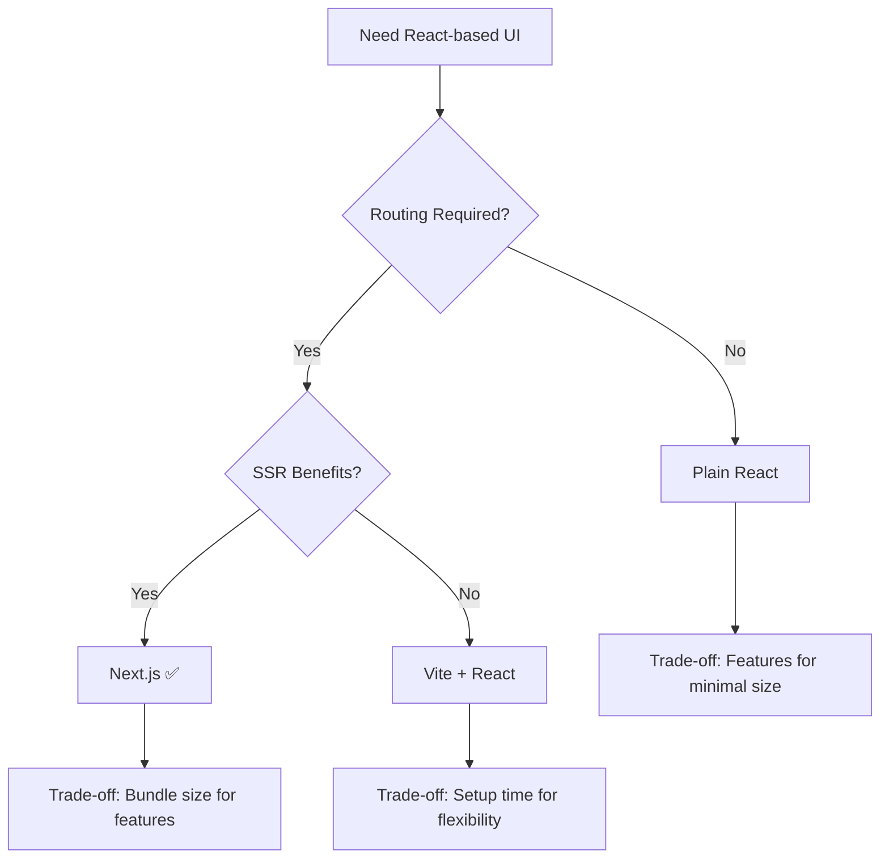

# CodeMap: Engineering Decisions & Trade-offs

**TL;DR:** Key technology and design decisions with honest trade-off assessment. Visual decision matrix shows alternatives considered and compromises accepted.

## Intent of This Document

This document captures engineering decisions made during CodeMap development. Each decision shows alternatives considered, rationale, and accepted trade-offs through visual comparison matrices and decision trees.

## Decision Overview Matrix

| **Decision Area** | **Chosen Technology** | **Key Alternative** | **Primary Trade-off** |
|-------------------|----------------------|---------------------|------------------------|
| **Backend Language** | Go | Node.js | Slower iteration ↔ Better performance |
| **Frontend Framework** | Next.js | Vite + React | Heavier footprint ↔ Built-in features |
| **Graph Database** | Neo4j | PostgreSQL | Operational complexity ↔ Natural relationships |
| **Relational Database** | PostgreSQL | MongoDB | Schema rigidity ↔ Data consistency |
| **Authentication** | JWT | Session-based | Token complexity ↔ Stateless scaling |

## 1. Backend Language – Go

### Decision Comparison

| **Criteria** | **Go** | **Node.js** | **Python** |
|--------------|--------|-------------|------------|
| **Concurrency** | ✅ Excellent (goroutines) | ⚠️ Good (event loop) | ❌ Limited (GIL) |
| **Performance** | ✅ Predictable, fast | ⚠️ Variable | ❌ Slower |
| **Type Safety** | ✅ Static typing | ❌ Dynamic | ❌ Dynamic |
| **Development Speed** | ❌ Slower iteration | ✅ Rapid prototyping | ✅ Quick scripting |
| **Library Ecosystem** | ⚠️ Growing | ✅ Massive | ✅ Extensive |

### Why Go Won

```
Analysis Workload Requirements:
├── Heavy file parsing operations
├── Concurrent processing needs
├── Predictable performance critical
└── Type safety for complex logic

Go Strengths Match:
├── ✅ Goroutines handle concurrency naturally
├── ✅ Static typing catches dependency bugs
├── ✅ Consistent performance characteristics
└── ✅ Excellent API development tooling
```

### Trade-offs Accepted

| **What We Gained** | **What We Lost** |
|-------------------|------------------|
| Predictable performance | Rapid prototyping speed |
| Strong concurrency | Large library ecosystem |
| Type safety | Dynamic flexibility |
| Robust error handling | Quick iteration cycles |

## 2. Frontend Framework – Next.js (React)

### Framework Comparison Matrix

| **Feature** | **Next.js** | **Vite + React** | **Plain React** |
|-------------|-------------|------------------|-----------------|
| **Setup Time** | ⚡ Instant | ⚠️ Configuration needed | ❌ Manual setup |
| **Routing** | ✅ Built-in | ❌ Add React Router | ❌ Manual implementation |
| **Performance** | ✅ SSR + optimization | ✅ Fast dev server | ⚠️ Client-side only |
| **Bundle Size** | ❌ Heavier | ✅ Minimal | ✅ Lightest |
| **Flexibility** | ⚠️ Opinionated | ✅ Configurable | ✅ Complete control |

### Decision Flow



### Why Next.js

> **Core Need:** Fast development with built-in routing for complex graph visualization UI

**Winning Factors:**
- 🚀 Zero-config routing eliminates setup overhead
- 📈 Built-in performance optimizations
- 🔧 Excellent developer experience with hot reloading
- 📚 Strong ecosystem for visualization libraries

**Accepted Compromises:**
- 📦 Larger bundle size vs. minimal React setups
- 🏗️ Framework opinions vs. complete flexibility

## 3. Graph Database – Neo4j

### Database Architecture Decision

```
Code Relationship Reality:
┌─────────────┐    calls    ┌─────────────┐
│  Function A │ ──────────> │  Function B │
└─────────────┘             └─────────────┘
       │                           │
       │ imports                   │ uses
       ▼                           ▼
┌─────────────┐             ┌─────────────┐
│   Module X  │             │ Variable Y  │
└─────────────┘             └─────────────┘

Graph DB = Natural fit for this structure
```

### Technology Comparison

| **Approach** | **Query Complexity** | **Performance** | **Operational Overhead** | **Learning Curve** |
|--------------|---------------------|-----------------|--------------------------|-------------------|
| **Neo4j** | ✅ Simple Cypher | ✅ Fast traversals | ❌ High | ❌ Steep |
| **PostgreSQL + Joins** | ❌ Complex SQL | ⚠️ Slower for graphs | ✅ Low | ✅ Familiar |
| **In-Memory Graphs** | ✅ Direct access | ✅ Fastest | ✅ Minimal | ⚠️ Custom logic |

### Decision Rationale

**The Graph Advantage:**
```sql
-- Neo4j Cypher (Simple)
MATCH (f:Function)-[:CALLS*1..3]->(deps)
WHERE f.name = "authenticate"
RETURN deps

-- PostgreSQL Equivalent (Complex)
WITH RECURSIVE deps AS (
  SELECT target_id, 1 as depth FROM calls WHERE source_id = ?
  UNION ALL
  SELECT c.target_id, d.depth + 1 
  FROM calls c JOIN deps d ON c.source_id = d.target_id
  WHERE d.depth < 3
) SELECT * FROM deps;
```

### Trade-off Analysis

| **✅ What We Gained** | **❌ What We Accepted** |
|----------------------|------------------------|
| Natural relationship queries | Additional database to manage |
| Fast dependency traversals | Team learning curve |
| Built-in graph algorithms | Higher memory usage |
| Intuitive data model | Limited hosting options |

## 4. Relational Database – PostgreSQL

### Structured Data Requirements

```
Application Data Structure:
├── User accounts & authentication
├── Project metadata & settings  
├── Analysis job status & history
└── System configuration & logs

Requirement: ACID compliance + structured queries
```

### Database Comparison

| **Database** | **ACID Compliance** | **Schema Flexibility** | **Ecosystem** | **Operational Complexity** |
|--------------|-------------------|----------------------|---------------|---------------------------|
| **PostgreSQL** | ✅ Full ACID | ❌ Rigid schema | ✅ Mature | ⚠️ Moderate |
| **MongoDB** | ⚠️ Eventually consistent | ✅ Flexible documents | ✅ Good | ✅ Simple |
| **SQLite** | ✅ Full ACID | ❌ Rigid schema | ⚠️ Limited | ✅ Minimal |

### Why PostgreSQL

**Decision Drivers:**
- 🔒 **Data Integrity:** User data and project metadata need consistency
- 📊 **Complex Queries:** Analytics and reporting require SQL capabilities  
- 🛠️ **Tooling:** Mature ecosystem for monitoring and management
- 🔄 **Reliability:** Battle-tested in production environments

**Trade-off Visualization:**
```
Flexibility ←→ Consistency
    │              │
MongoDB        PostgreSQL ✅
    │              │
Simple ops ←→ Rich features
```

## 5. Authentication – JWT

### Authentication Architecture Decision

```
Session-based:
Client ←→ Server (stores session)
  │         │
  └─ Cookie ─┘
  
JWT-based:
Client ←→ Server (stateless)
  │         │
  └─ Token ──┘ (self-contained)
```

### Comparison Matrix

| **Aspect** | **JWT** | **Session-based** |
|------------|---------|-------------------|
| **Server State** | ✅ Stateless | ❌ Session storage required |
| **Scalability** | ✅ Easy horizontal scaling | ⚠️ Shared session store needed |
| **Security** | ⚠️ Token revocation complex | ✅ Immediate revocation |
| **Network Overhead** | ❌ Larger requests | ✅ Small cookies |
| **Implementation** | ✅ Standard libraries | ⚠️ Custom session management |

### Decision Flow

```
API Design Goal: Stateless scaling
         │
         ▼
    Need authentication
         │
    ┌────┴────┐
    │         │
Sessions    JWT ✅
    │         │
Shared      Stateless
storage     scaling
required    enabled
```

### Trade-off Summary

| **JWT Benefits** | **JWT Costs** |
|------------------|---------------|
| 🚀 Stateless API design | 🔄 Complex token revocation |
| 📈 Easy scaling | 📦 Larger request payloads |
| 🔧 Standard implementation | 🧠 Frontend token management |
| 🌐 Cross-service compatibility | 🔒 Token storage security |
