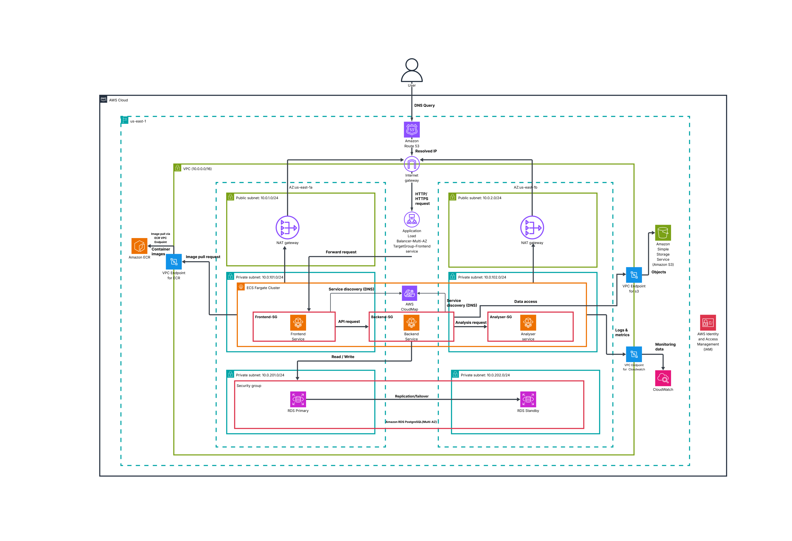

# CodeMap: Future Decisions & Scaling Plans

**TL;DR:** Strategic roadmap from hackathon MVP to enterprise-scale platform. Visual decision matrices, AWS architecture diagrams, and cost-aware scaling triggers.

## 🎯 Current State vs Future Vision

```
📊 CODEMAP EVOLUTION ROADMAP
┌─────────────────────────────────────────────────────────────────┐
│                    NOW → NEXT → FUTURE                         │
├─────────────────────────────────────────────────────────────────┤
│  🏗️ MVP (Current)     📈 Scale (6 months)   🏢 Enterprise (1yr) │
│  ┌─────────────────┐  ┌─────────────────┐  ┌─────────────────┐ │
│  │ ✅ 1K files     │  │ 🎯 10K files    │  │ 🚀 100K+ files │ │
│  │ ✅ Basic graphs │  │ 🎯 Smart filter │  │ 🚀 AI insights │ │
│  │ ✅ Local deploy │  │ 🎯 AWS cloud    │  │ 🚀 Multi-tenant │ │
│  │ ✅ Single user  │  │ 🎯 Team collab  │  │ 🚀 Enterprise   │ │
│  └─────────────────┘  └─────────────────┘  └─────────────────┘ │
│         │                      │                      │         │
│    Hackathon              Product-Market           Scale        │
│    Validation                  Fit              Operations      │
└─────────────────────────────────────────────────────────────────┘
```

## 🚧 Current Intentional Limitations

| **Limitation** | **Why We Chose This** | **Future Solution** |
|----------------|----------------------|-------------------|
| 📏 **1K File Limit** | Reliable demo performance | Smart clustering + progressive loading |
| 🏠 **Local Deployment** | Zero AWS costs during hackathon | Full cloud architecture ready |
| 👤 **Single User** | Simplified authentication | Multi-tenant with team features |
| 🎨 **Basic Filtering** | Core functionality first | Advanced graph algorithms |

## 🚀 Graph Scaling Strategy

### Performance Scaling Matrix

```
📈 CODEBASE SIZE → SOLUTION STRATEGY
┌─────────────────────────────────────────────────────────────────┐
│  Size Range    │ Current Approach │ Planned Solution │ Timeline │
├─────────────────────────────────────────────────────────────────┤
│  📁 1-1K files │ ✅ Full render   │ ✅ Works great   │ Now      │
│  📂 1K-10K     │ ⚠️ Slow loading  │ 🎯 Smart cluster │ 3 months │
│  📚 10K-50K    │ ❌ Not supported │ 🔄 Progressive   │ 6 months │
│  🏢 50K+       │ ❌ Not supported │ 🧠 AI-powered    │ 12 months│
└─────────────────────────────────────────────────────────────────┘
```

### Smart Clustering Algorithm

```
🧠 INTELLIGENT GRAPH CLUSTERING
┌─────────────────────────────────────────────────────────────────┐
│                                                                 │
│  Raw Codebase (10K files)                                      │
│           ↓                                                     │
│  🔍 Analyze Relationships                                       │
│           ↓                                                     │
│  📊 Group by Modules                                            │
│  ┌─────────────────────────────────────────────────────────┐   │
│  │ 🏗️ Auth Module    🛒 Payment Module   📊 Analytics     │   │
│  │ ├── login.js     ├── stripe.js       ├── tracking.js  │   │
│  │ ├── auth.js      ├── billing.js      ├── metrics.js   │   │
│  │ └── tokens.js    └── invoices.js     └── reports.js   │   │
│  └─────────────────────────────────────────────────────────┘   │
│           ↓                                                     │
│  🎨 Render as Expandable Clusters                               │
│  ┌─────────────────────────────────────────────────────────┐   │
│  │ [Auth] ←→ [Payment] ←→ [Analytics]                      │   │
│  │   ↓        ↓           ↓                                │   │
│  │ Click to  Click to   Click to                          │   │
│  │ expand    expand     expand                             │   │
│  └─────────────────────────────────────────────────────────┘   │
│                                                                 │
└─────────────────────────────────────────────────────────────────┘
```

### Progressive Loading Strategy

| **User Action** | **What Loads** | **Performance Impact** |
|-----------------|----------------|------------------------|
| 🎯 **Initial View** | Module clusters only | ⚡ Instant (10-20 nodes) |
| 🖱️ **Click Module** | Functions within module | ⚡ Fast (50-100 nodes) |
| 🔍 **Expand Function** | Direct dependencies | ⚡ Quick (10-30 nodes) |
| 🌐 **Full Exploration** | Complete subgraph | ⚠️ Managed (500+ nodes) |

## ☁️ AWS Architecture Strategy

### Current vs Planned Deployment

```
🏠 CURRENT (Local Development)
┌─────────────────────────────────────────────────────────────────┐
│  Developer Machine                                              │
│  ┌─────────────────────────────────────────────────────────┐   │
│  │ 💻 Next.js Frontend                                     │   │
│  │ 🔧 Go API Server                                        │   │
│  │ 🗄️ PostgreSQL                                           │   │
│  │ 📊 Neo4j Database                                       │   │
│  └─────────────────────────────────────────────────────────┘   │
│                                                                 │
│  ✅ Zero cloud costs  ✅ Fast iteration  ✅ Full control       │
└─────────────────────────────────────────────────────────────────┘

☁️ PLANNED (AWS Production)
┌─────────────────────────────────────────────────────────────────┐
│  AWS Cloud Infrastructure                                       │
│  ┌─────────────────────────────────────────────────────────┐   │
│  │ 🌐 CloudFront CDN                                       │   │
│  │ ⚖️ Application Load Balancer                            │   │
│  │ 🐳 ECS Fargate (Go API)                                 │   │
│  │ 🗄️ RDS PostgreSQL (Multi-AZ)                            │   │
│  │ 📊 Neo4j AuraDB (Managed)                               │   │
│  │ 📦 S3 (File Storage)                                    │   │
│  └─────────────────────────────────────────────────────────┘   │
│                                                                 │
│  🚀 Auto-scaling  🛡️ High availability  📈 Global reach       │
└─────────────────────────────────────────────────────────────────┘
```



*Complete AWS production deployment architecture designed for CodeMap scaling*

### AWS Service Selection Matrix

| **Service** | **Alternative** | **Why AWS Choice Wins** | **Cost Impact** |
|-------------|-----------------|-------------------------|-----------------|
| **ECS Fargate** | EKS/EC2 | No cluster management | 💰 Medium |
| **RDS Multi-AZ** | Self-managed | Automatic failover | 💰💰 Higher |
| **Neo4j AuraDB** | Self-hosted | Managed graph database | 💰💰💰 Premium |
| **CloudFront** | Direct ALB | Global performance | 💰 Low |
| **S3** | EBS/EFS | Object storage simplicity | 💰 Minimal |

### Cost-Aware Architecture Decisions

```
💸 COST OPTIMIZATION STRATEGY
┌─────────────────────────────────────────────────────────────────┐
│                                                                 │
│  🎯 Phase 1: Minimal Viable Cloud (MVP)                        │
│  ┌─────────────────────────────────────────────────────────┐   │
│  │ • Single AZ deployment                                  │   │
│  │ • t3.small instances                                    │   │
│  │ • Basic monitoring                                      │   │
│  │ • Estimated: $200-300/month                            │   │
│  └─────────────────────────────────────────────────────────┘   │
│                                                                 │
│  📈 Phase 2: Production Ready (Scale)                          │
│  ┌─────────────────────────────────────────────────────────┐   │
│  │ • Multi-AZ with auto-scaling                           │   │
│  │ • Enhanced monitoring                                   │   │
│  │ • CDN and caching                                       │   │
│  │ • Estimated: $800-1200/month                           │   │
│  └─────────────────────────────────────────────────────────┘   │
│                                                                 │
│  🏢 Phase 3: Enterprise Scale (Growth)                         │
│  ┌─────────────────────────────────────────────────────────┐   │
│  │ • Multi-region deployment                               │   │
│  │ • Advanced analytics                                    │   │
│  │ • Enterprise support                                    │   │
│  │ • Estimated: $3000-5000/month                          │   │
│  └─────────────────────────────────────────────────────────┘   │
│                                                                 │
└─────────────────────────────────────────────────────────────────┘
```

## 🔄 Infrastructure Evolution Timeline

### Migration Strategy Roadmap

```
🛣️ INFRASTRUCTURE EVOLUTION PATH
┌─────────────────────────────────────────────────────────────────┐
│                                                                 │
│  Month 1-3: Cloud Foundation                                    │
│  ┌─────────────────────────────────────────────────────────┐   │
│  │ 🎯 Deploy basic AWS stack                               │   │
│  │ 🎯 Migrate from local to cloud                          │   │
│  │ 🎯 Basic monitoring setup                               │   │
│  │ 🎯 SSL certificates and domain                          │   │
│  └─────────────────────────────────────────────────────────┘   │
│                                                                 │
│  Month 4-6: Performance & Scale                                │
│  ┌─────────────────────────────────────────────────────────┐   │
│  │ 📈 Auto-scaling implementation                          │   │
│  │ 📈 CDN and caching layers                               │   │
│  │ 📈 Database optimization                                │   │
│  │ 📈 Advanced graph algorithms                            │   │
│  └─────────────────────────────────────────────────────────┘   │
│                                                                 │
│  Month 7-12: Enterprise Features                               │
│  ┌─────────────────────────────────────────────────────────┐   │
│  │ 🏢 Multi-tenant architecture                            │   │
│  │ 🏢 Team collaboration features                          │   │
│  │ 🏢 Advanced analytics dashboard                         │   │
│  │ 🏢 Enterprise security compliance                       │   │
│  └─────────────────────────────────────────────────────────┘   │
│                                                                 │
└─────────────────────────────────────────────────────────────────┘
```

### Technology Upgrade Triggers

| **Upgrade** | **Current State** | **Trigger Point** | **Expected Benefit** |
|-------------|-------------------|-------------------|---------------------|
| **ECS → EKS** | Simple containers | Multiple services | Better orchestration |
| **Basic → Advanced Monitoring** | CloudWatch only | Performance issues | Faster debugging |
| **Single → Multi-AZ** | Cost optimization | High availability needs | 99.9% uptime |
| **Manual → Auto CI/CD** | Manual deploys | Team growth | Faster releases |

## 📊 Observability Strategy

### Monitoring Stack Evolution

```
📈 OBSERVABILITY MATURITY LEVELS
┌─────────────────────────────────────────────────────────────────┐
│                                                                 │
│  Level 1: Basic (Current)                                       │
│  ┌─────────────────────────────────────────────────────────┐   │
│  │ 📊 CloudWatch metrics                                   │   │
│  │ 📝 Application logs                                     │   │
│  │ 🚨 Basic error alerts                                   │   │
│  └─────────────────────────────────────────────────────────┘   │
│                                                                 │
│  Level 2: Enhanced (6 months)                                  │
│  ┌─────────────────────────────────────────────────────────┐   │
│  │ 📊 Prometheus + Grafana                                 │   │
│  │ 📝 Structured logging with Loki                         │   │
│  │ 🔍 Distributed tracing                                  │   │
│  │ 🚨 Smart alerting rules                                 │   │
│  └─────────────────────────────────────────────────────────┘   │
│                                                                 │
│  Level 3: Advanced (12 months)                                 │
│  ┌─────────────────────────────────────────────────────────┐   │
│  │ 🤖 AI-powered anomaly detection                         │   │
│  │ 📈 Business metrics dashboard                           │   │
│  │ 🔄 Automated incident response                          │   │
│  │ 📊 Predictive scaling                                   │   │
│  └─────────────────────────────────────────────────────────┘   │
│                                                                 │
└─────────────────────────────────────────────────────────────────┘
```

### Key Metrics to Track

| **Category** | **Metrics** | **Why Important** |
|--------------|-------------|-------------------|
| **Performance** | Graph render time, API response | User experience quality |
| **Usage** | Active users, projects analyzed | Product-market fit |
| **System Health** | Error rates, uptime, resource usage | Operational stability |
| **Business** | Conversion rates, feature adoption | Growth optimization |

## 🎯 Decision Framework

### When to Scale What

```
🚦 SCALING DECISION MATRIX
┌─────────────────────────────────────────────────────────────────┐
│  Trigger Signal          │ Action Required    │ Timeline         │
├─────────────────────────────────────────────────────────────────┤
│  🔥 Performance Issues   │ → Optimize queries │ Immediate        │
│  📈 User Growth (100+)   │ → AWS deployment   │ 1-2 months       │
│  🏢 Enterprise Interest  │ → Multi-tenant     │ 3-6 months       │
│  🌍 Global Users         │ → Multi-region     │ 6-12 months      │
│  🤖 Complex Analysis     │ → AI features      │ 12+ months       │
└─────────────────────────────────────────────────────────────────┘
```

### Cost vs Capability Trade-offs

```
💰 INVESTMENT PRIORITY MATRIX
┌─────────────────────────────────────────────────────────────────┐
│                                                                 │
│  High Impact, Low Cost (Do First)                              │
│  ┌─────────────────────────────────────────────────────────┐   │
│  │ ✅ Basic AWS deployment                                 │   │
│  │ ✅ Performance optimization                             │   │
│  │ ✅ User authentication                                  │   │
│  └─────────────────────────────────────────────────────────┘   │
│                                                                 │
│  High Impact, High Cost (Plan Carefully)                       │
│  ┌─────────────────────────────────────────────────────────┐   │
│  │ 🎯 Multi-tenant architecture                            │   │
│  │ 🎯 Advanced graph algorithms                            │   │
│  │ 🎯 Enterprise security features                         │   │
│  └─────────────────────────────────────────────────────────┘   │
│                                                                 │
│  Low Impact, Any Cost (Do Later)                               │
│  ┌─────────────────────────────────────────────────────────┐   │
│  │ ⏳ Advanced analytics                                   │   │
│  │ ⏳ Custom integrations                                  │   │
│  │ ⏳ White-label solutions                                │   │
│  └─────────────────────────────────────────────────────────┘   │
│                                                                 │
└─────────────────────────────────────────────────────────────────┘
```

## 🏁 Strategic Summary

### Our Scaling Philosophy

| **Principle** | **What This Means** | **Why It Matters** |
|---------------|--------------------|--------------------|
| **🎯 User-Driven** | Scale based on real usage patterns | Avoid over-engineering |
| **💰 Cost-Conscious** | Optimize for value, not features | Sustainable growth |
| **🏗️ Architecture-First** | Build foundation before features | Avoid technical debt |
| **📊 Data-Informed** | Measure before optimizing | Focus effort effectively |

### Success Metrics

```
📈 GROWTH INDICATORS
┌─────────────────────────────────────────────────────────────────┐
│                                                                 │
│  Phase 1 Success (MVP Validation)                               │
│  ├── 👥 100+ active users                                       │
│  ├── 📊 1000+ projects analyzed                                 │
│  ├── ⭐ 4.5+ user satisfaction                                  │
│  └── 💰 $5K+ monthly revenue                                    │
│                                                                 │
│  Phase 2 Success (Product-Market Fit)                          │
│  ├── 👥 1000+ active users                                      │
│  ├── 📊 10K+ projects analyzed                                  │
│  ├── 🏢 10+ enterprise customers                                │
│  └── 💰 $50K+ monthly revenue                                   │
│                                                                 │
│  Phase 3 Success (Scale Operations)                             │
│  ├── 👥 10K+ active users                                       │
│  ├── 📊 100K+ projects analyzed                                 │
│  ├── 🌍 Multi-region deployment                                 │
│  └── 💰 $500K+ monthly revenue                                  │
│                                                                 │
└─────────────────────────────────────────────────────────────────┘
```

**Bottom Line:** CodeMap is built with intentional constraints today and a clear, cost-aware path to enterprise scale tomorrow. Every decision balances current limitations with future possibilities.